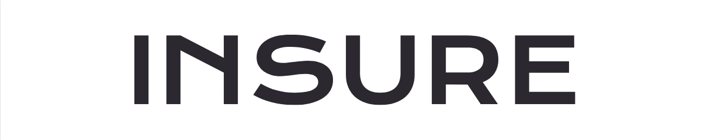
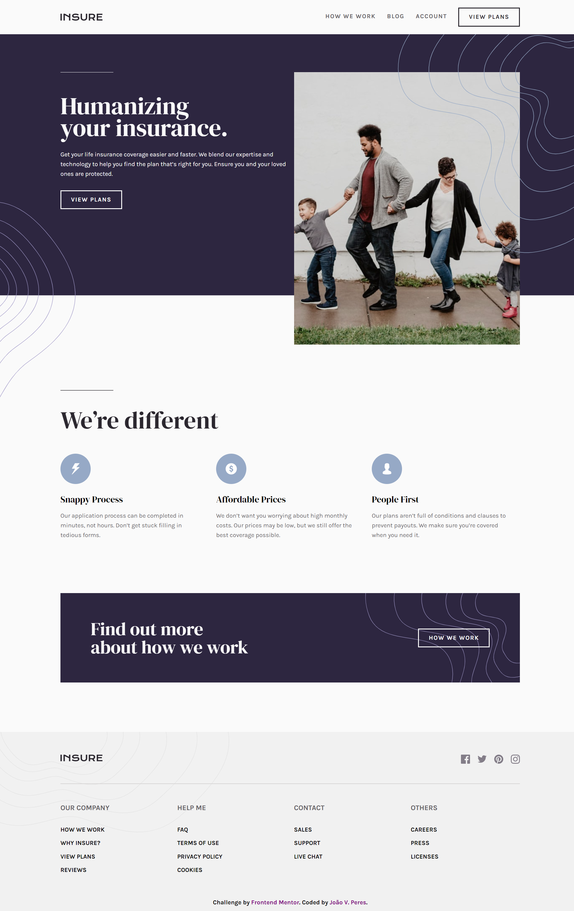

# 

O projeto Insure foi feito com base na proposta do site Frontend Mentor e consiste na criação de uma landing page responsiva com o tema da agência de seguros de vida Insure.
 

Na landing page são mostradas informações, vantagens do serviço oferecido pela empresa, testemunhos dos clientes e rodapé com links úteis para contato, ajuda entre outros.

  <a href="#processo">Processo</a> --
  <a href="#tecnologias">Tecnologias Utilizadas</a> --
  <a href="#aprendizados">Aprendizados</a> --
  <a href="#final">Projeto Final</a> 

<h1 align="center">
  

</h1>

 

# Processo

A tipografia utilizada para parágrafos foi <strong>"Karla"</strong> e para títulos <strong>"DM Serif Display"</strong>. 

O site foi construído de acordo com as Landmarks do HTML <strong>header</strong>, <strong>main</strong>, <strong>section</strong> e <strong>articles</strong> e por fim o <strong>footer</strong>. A parte responsiva foi feita após a finalização do site para tamanhos de tela de desktops. Algumas dificuldades surgiram ao deixar o site responsivo para dispositivos mobile, principalmente ao ajustar imagens e menu de navegação. A situação foi resolvida ao serem adicionados media queries.

O CSS foi dividido em arquivos na pasta <strong>style</strong> com os respectivos nomes dos blocos em que aplicam os estilos. Tanto a tipografia, como as variáveis de cores foram colocadas em arquivos separados para melhor organização. O layout do site foi contruído de acordo com as imagens da pasta <strong>design</strong>.

As otimizações ao final do projeto foram feitas acompanhando a avaliação da ferramenta <strong>Lighthouse</strong> do Google Chrome. Nesse projeto a acessibilidade e semântica do site foram melhor desenvolvidos, incluindo <strong>aria-label</strong>, descrição de imagens utilizando o atributo <strong>alt</strong>, etc.

 
 

# Tecnologias

Tecnologias utilizadas no projeto:

<ul>
  <li>HTML</li>
  <li>CSS</li>
  <li>JavaScript</li>
</ul>

 
 

# Aprendizados

Ao decorrer do desenvolvimento do projeto busquei constantemente fazer um site com ótima acessibilidade, o que me levou a pesquisar sobre o tema e realizar alterações de cores no layout, tags semânticas, descrições de imagens e criação de um menu mobile que fosse acessível também aos leitores de tela, utilizando para isso o JavaScript para alteração do HTML de acordo com a interação do usuário.

Para realizar certos trechos do site tive que trabalhar muito com propriedades de <strong>object-fit</strong>, <strong>object-position</strong> e <strong>background</strong>, a fim de deixar imagens proporcionais ao tamanho de tela, mas sem que afetassem o bloco em que estavam inseridas, bem como criar o design proposto do projeto.

Como o site primeiro foi feito para versões de desktop, foram encontradas dificuldades para deixar certos elementos responsivos no mobile. Como alternativa foram usados media queries, porém também foi pesquisado sobre o modelo de mobile first, que apesar de não ser utilizado no projeto me deu mais entendimento sobre o processo.

Habilidades desenvolvidas:

<ul>
  <li>Manipulação e adição de imagens SVG de fundo com pseudo elementos</li>
  <li>Desenvolvimento de menu mobile acessível e responsivo</li>
  <li>Maior acessibilidade em tags semânticas, imagens sem texto e layout</li>
  <li>Responsividade do site e media queries</li>
  <li>Alteração de atributos de tags no HTML com JavaScript de acordo com ações do usuário</li>
</ul>

 
 

# Final

O projeto está em desenvolvimento... 

